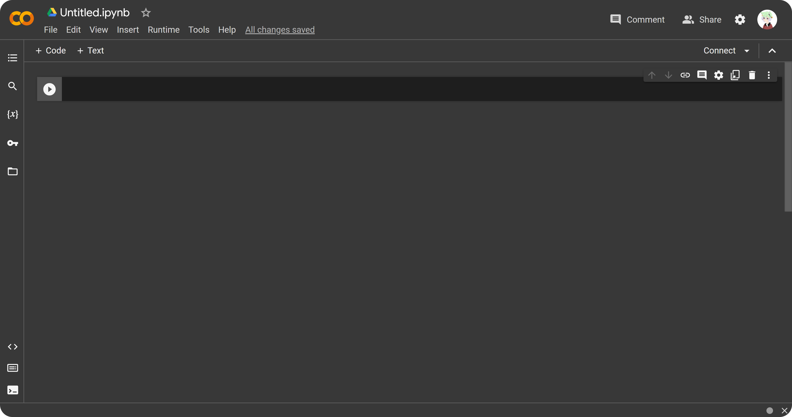
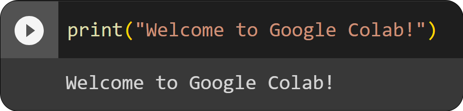

# Introduction

Welcome to the introduction of this documentation, first we are going to know a little bit about the Google Colab interface and then some basics of Python and Jupiter Notebook.

<p align="center">
    
</p>

## Steps

Step 1. The first thing we are going to do is to enter https://colab.google and click on New Notebook.

<p align="center">
    
</p>

Step 2. Once we have entered our Jupiter Notebook environment, it will generate a code box. This is where we will write our Python code.

<p align="center">
    
</p>

Step 3. Copy this code below and see what happens. Don't worry, you don't have to understand it for now, you will know what it means later.

```python
print("Welcome to Google Colab!")
```

Already in Colab you should see something like this.

<p align="left">
    
</p>

#### Excellent! Now yes, we will start with a little programming explanation.